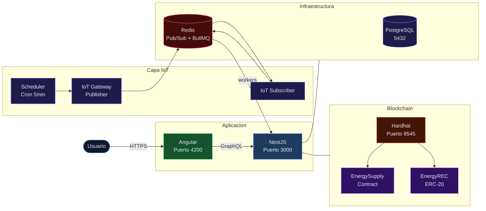
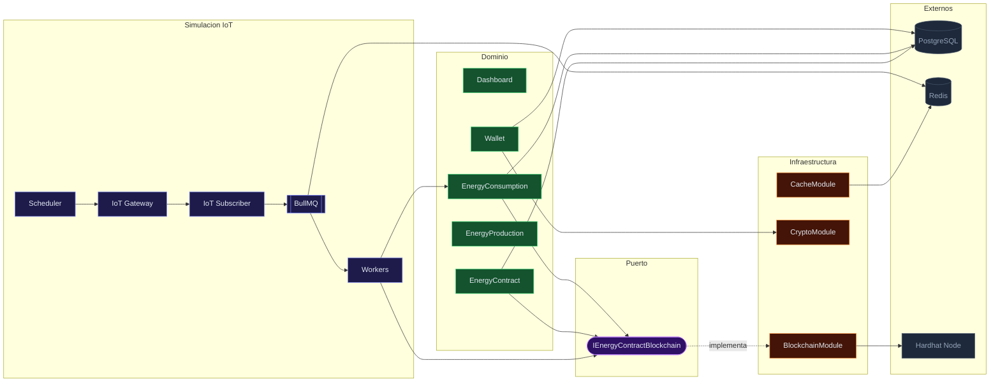

# ⚡ Blockchain Energía

> Plataforma P2P de comercio de energía renovable construida sobre Ethereum. Permite a prosumidores vender el excedente de su producción energética directamente a consumidores mediante contratos inteligentes, sin intermediarios. Cada kWh producido se certifica on-chain como un Certificado de Energía Renovable (REC) mediante un token ERC-20, y se quema al ser consumido, garantizando trazabilidad completa de la fuente energética.

<div align="center">


</div>

---

## Tabla de contenidos

- [Arquitectura](#arquitectura)
- [Contratos inteligentes](#contratos-inteligentes)
- [Flujo IoT simulado](#flujo-iot-simulado)
- [Tokenización REC](#tokenización-rec)
- [Tecnologías](#tecnologías)
- [Requisitos](#requisitos)
- [Instalación y puesta en marcha](#instalación-y-puesta-en-marcha)
- [Variables de entorno](#variables-de-entorno)
- [Scripts disponibles](#scripts-disponibles)
- [Patrones de diseño implementados](#patrones-de-diseño-implementados)
- [Estructura del proyecto](#estructura-del-proyecto)
- [Tests](#tests)

---

## Arquitectura

### Vista general del sistema



### Arquitectura hexagonal del backend

El backend implementa **Ports and Adapters**. La lógica de negocio depende de la interfaz `IEnergyContractBlockchain` (puerto), no de `BlockchainService` directamente. La blockchain puede reemplazarse sin modificar los servicios de dominio.



### Flujo completo: contratar energía P2P

```mermaid
sequenceDiagram
    actor Comprador
    participant BE as NestJS Backend
    participant DB as PostgreSQL
    participant PORT as IEnergyContractBlockchain
    participant BC as Hardhat Node

    Comprador->>BE: mutation contractOffer(offerId)

    rect rgb(20, 40, 80)
        Note over BE,DB: Transacción DB ACID
        BE->>DB: findOne EnergyOffer con LOCK
        BE->>DB: findOne buyerWallet y sellerWallet
        BE->>DB: save EnergyContract PENDING_BLOCKCHAIN
    end

    rect rgb(40, 20, 80)
        Note over BE,BC: Registro en Blockchain
        BE->>PORT: deployEnergyContract(buyer, seller, price, dates, sourceType)
        PORT->>BC: ethers.js deploy EnergySupplyContract
        BC-->>PORT: contractAddress
        BE->>PORT: activateContract(contractAddress)
        BC-->>BE: confirmed
    end

    BE->>DB: update contract ACTIVE + sourceType
    BE-->>Comprador: contractAddress y status ACTIVE
```



---

## Contratos inteligentes

El sistema utiliza dos contratos Solidity desplegados en un nodo Hardhat local.

### EnergySupplyContract.sol

Gestiona el ciclo de vida completo de un contrato de suministro P2P entre un productor y un consumidor.

**Estado del contrato:**

| Estado | Descripción |
|---|---|
| `CREATED` | Desplegado, pendiente de activación |
| `ACTIVE` | En operación, acepta reportes de consumo |
| `SUSPENDED` | Pausado por fondos insuficientes o falta de producción |
| `CANCELED` | Cancelado voluntariamente por una de las partes |
| `TERMINATED` | Terminado por vencimiento del plazo |
| `COMPLETED` | Finalizado exitosamente |

**Variables on-chain:** `buyer`, `seller`, `oracle`, `sourceType`, `pricePerKwhCop`, `startTimestamp`, `endTimestamp`, `state`, `consumedKwh`.

### EnergyREC.sol — ERC-20

Token de Certificado de Energía Renovable. Cada unidad representa 1/10.000 kWh producido. La escala de 10.000 permite registrar fracciones de kWh con precisión de 4 decimales en enteros Solidity.

| Operación | Cuándo ocurre | Actor |
|---|---|---|
| `mintREC(producer, sourceType, kwhAmount)` | Al registrar una producción SYNCED | Productor |
| `burnREC(seller, contractAddress, kwhAmount)` | Al reportar un consumo certificado | Vendedor (entrega RECs) |

El `sourceType` queda registrado on-chain en cada mint, permitiendo auditar qué proporción del total proviene de solar, eólica, hídrica o biomasa.

---

## Flujo IoT simulado

Los medidores inteligentes se simulan con `IoTGatewayService`, que publica lecturas cada 5 minutos usando **Redis Pub/Sub** con estructura de topics compatible con MQTT.

```
Topic producción:  iot/meter/{sourceId}/reading
Topic consumo:     iot/meter/{contractId}/demand
Topic red:         iot/network/status
```

**Protocolo del mensaje (producción):**
```json
{
  "deviceId": "uuid-de-la-fuente",
  "userId": "uuid-del-productor",
  "sourceType": "SOLAR",
  "capacityKw": 10.5,
  "timestamp": "2026-03-04T00:00:00.000Z",
  "protocol": "MQTT_SIM"
}
```

**Pipeline completo:**

```
Cron (5min)
  → IoTGatewayService.publishProductionReadings()
    → Redis PUBLISH iot/meter/{id}/reading
      → IoTSubscriberService (psubscribe)
        → BullMQ productionQueue.add(job)
          → ProductionWorker.process(job)
            → INSERT energy_production
            → UPDATE wallet.energyStored
            → blockchainService.mintREC()  ← on-chain
```

En un sistema real, el `IoTGatewayService` recibiría los datos de un broker MQTT (Mosquitto, HiveMQ) o de dispositivos LoRaWAN, sin cambios en el resto del pipeline.

---

## Tokenización REC

El ciclo completo de certificación de energía renovable es:

```
Producción IoT
  → mintREC(producerAddress, "SOLAR", kwhAmount)
    → EnergyREC.balanceOf(producer) += kwhAmount * 10000

Contratación
  → EnergySupplyContract.deploy(..., sourceType="SOLAR")
    → sourceType queda inmutable on-chain

Consumo reportado
  → EnergySupplyContract.reportConsumption(kwhAmount)
  → burnREC(sellerAddress, contractAddress, kwhAmount)
    → EnergyREC.balanceOf(seller) -= kwhAmount * 10000
    → evento RECBurned(consumer, contractAddress, kwhAmount, timestamp)
```

Esto garantiza que cada kWh consumido bajo un contrato activo tiene un REC correspondiente que acredita su origen renovable, auditable on-chain en cualquier momento.

---

## Tecnologías

| Capa | Tecnología | Versión |
|---|---|---|
| Frontend | Angular | 21 |
| Backend | NestJS | 10 |
| API | GraphQL — Apollo | 4 |
| ORM | TypeORM | 0.3 |
| Smart Contracts | Solidity / Hardhat | 0.8 / 3 |
| Base de datos | PostgreSQL | 16 |
| Caché y Colas | Redis / BullMQ | 7 |
| IoT simulado | Redis Pub/Sub (MQTT-compatible) | 7 |
| Tokenización | ERC-20 (EnergyREC) | — |
| Cifrado | AES-256-GCM — Node crypto | — |
| Blockchain client | ethers.js | 6 |
| Contenedores | Docker Compose | v5 |
| Tests | Jest / @nestjs/testing | 30 |

---

## Requisitos

- [Node.js](https://nodejs.org/) >= 20
- [Docker Desktop](https://www.docker.com/products/docker-desktop/) con WSL2 (Windows) o Docker Engine (Linux/Mac)
- Git

---

## Instalación y puesta en marcha

### 1. Clonar el repositorio

```bash
git clone https://github.com/tu-usuario/blockchain-energia.git
cd blockchain-energia
```

### 2. Levantar la infraestructura con Docker

```bash
docker compose up -d
```

Levanta PostgreSQL (5432) y Redis (6379). Verifica que estén `healthy`:

```bash
docker compose ps
```

### 3. Configurar variables de entorno del backend

```bash
cp backend/.env.example backend/.env
```

Edita `backend/.env` con tus valores (ver [Variables de entorno](#variables-de-entorno)).

### 4. Instalar dependencias e iniciar el backend

```bash
cd backend
npm install
npm run start:dev
```

El servidor GraphQL estará en `http://localhost:3000/graphql`.

### 5. Iniciar el nodo Hardhat

En una terminal separada:

```bash
cd smart-contracts
npm install
npx hardhat node
```

El nodo RPC estará en `http://localhost:8545`.

### 6. Desplegar los contratos

En otra terminal, con el nodo Hardhat corriendo:

```bash
cd smart-contracts
npx hardhat run scripts/deployEnergyREC.ts --network hardhatMainnet
```

Copia la dirección impresa y agrégala a `backend/.env` como `ENERGY_REC_CONTRACT_ADDRESS`.

### 7. Instalar dependencias e iniciar el frontend

```bash
cd frontend
npm install
ng serve
```

La aplicación estará en `http://localhost:4200`.

---

## Variables de entorno

Crea `backend/.env` a partir de `backend/.env.example`:

```env
# Base de datos
DB_HOST=localhost
DB_PORT=5432
DB_USER=energia_user
DB_PASS=energia_pass
DB_NAME=blockchain_energia
DB_SYNC=true

# Redis
REDIS_URL=redis://localhost:6379

# JWT — mínimo 32 caracteres
JWT_SECRET=cambia_esto_por_un_secreto_seguro_minimo_32_chars

# Cifrado de wallets — exactamente 32 caracteres
WALLET_ENCRYPTION_KEY=cambia_esto_exactamente_32_chars!

# Blockchain
BLOCKCHAIN_RPC=http://localhost:8545
PLATFORM_PRIVATE_KEY=0xac0974bec39a17e36ba4a6b4d238ff944bacb478cbed5efcae784d7bf4f2ff80

# Contrato ERC-20 REC — se obtiene al ejecutar deployEnergyREC.ts
ENERGY_REC_CONTRACT_ADDRESS=0x...

# App
NODE_ENV=development
PORT=3000
FRONTEND_URL=http://localhost:4200
```

> ⚠️ `PLATFORM_PRIVATE_KEY` corresponde a la cuenta #0 de Hardhat. Nunca usar en producción.

---

## Scripts disponibles

### Backend

```bash
npm run start:dev     # Desarrollo con hot-reload
npm run start:prod    # Producción — requiere build previo
npm run build         # Compilar TypeScript
npm test              # Tests unitarios
npm run test:cov      # Tests con reporte de cobertura
```

### Docker

```bash
docker compose up -d        # Levantar PostgreSQL y Redis
docker compose down         # Apagar — datos conservados en volumes
docker compose down -v      # Apagar y eliminar todos los datos
docker compose ps           # Estado de los servicios
```

### Smart Contracts

```bash
# Nodo local
npx hardhat node

# Compilar contratos
npx hardhat compile

# Tests de contratos
npx hardhat test

# Desplegar EnergyREC (ERC-20) — ejecutar una sola vez
npx hardhat run scripts/deployEnergyREC.ts --network hardhatMainnet

# Inspeccionar el estado de contratos de suministro on-chain
npx hardhat run scripts/replayEnergySupply.ts --network hardhatMainnet

# Inspeccionar mints y burns de RECs on-chain
npx hardhat run scripts/replayEnergyREC.ts --network hardhatMainnet
```

---

## Patrones de diseño implementados

### Arquitectura hexagonal — Ports and Adapters

`EnergyContractService` y `EnergyConsumptionService` dependen de `IEnergyContractBlockchain` (puerto), no de `BlockchainService` directamente. Permite mockear la blockchain en tests y reemplazar el proveedor sin tocar la lógica de dominio.

### IoT Gateway con Redis Pub/Sub

`IoTGatewayService` actúa como publisher MQTT-compatible sobre Redis Pub/Sub. `IoTSubscriberService` suscribe con `psubscribe` usando wildcards (`iot/meter/*/reading`). Replica el patrón de un gateway IoT real conectado a Mosquitto o HiveMQ, sin dependencia de un broker externo en el entorno de desarrollo.

### Producer/Consumer con BullMQ

`SimulationScheduler` solo encola jobs y retorna inmediatamente. `ProductionWorker` y `ConsumptionWorker` procesan en paralelo fuera del hilo principal sin bloquear la API GraphQL.

### Cache-Aside con Redis

`DashboardService` aplica cache-aside en métodos de agregación con TTLs según volatilidad del dato: 5 minutos para KPIs en tiempo real, 15 minutos para históricos mensuales. Fallback automático a memoria si Redis no está disponible.

### DataLoader — prevención de N+1

Los resolvers GraphQL usan DataLoader para batching. N contratos con consumptions pasa de N queries individuales a una sola query `WHERE contractId IN (...)`.

### Cifrado AES-256-GCM

Las claves privadas de wallets Ethereum se cifran antes de persistir en base de datos. Formato: `iv:authTag:encryptedData`. El `authTag` GCM detecta cualquier manipulación del ciphertext.

### Resiliencia de Nonce blockchain

`BlockchainService` detecta errores de nonce desincronizado (`Nonce too high / too low`), ejecuta `signer.reset()` para resincronizar con el nodo y reintenta la transacción automáticamente. Esencial en entornos de desarrollo donde Hardhat puede reiniciarse sin reiniciar el backend.

---

## Estructura del proyecto

```
blockchain-energia/
├── backend/
│   └── src/
│       ├── application/        # Dashboard, KPIs y analytics
│       ├── auth/               # JWT y guards
│       ├── energy/             # Dominio — contratos, consumo, ofertas, producción, fuentes
│       ├── finance/            # Dominio — wallets y transacciones
│       ├── infrastructure/     # Adaptadores — blockchain (ethers.js), Redis, crypto
│       ├── simulation/         # IoT Gateway, Subscriber, Scheduler y Workers BullMQ
│       └── users/
├── frontend/                   # SPA Angular — standalone components
├── smart-contracts/
│   ├── contracts/
│   │   ├── EnergySupplyContract.sol   # Contrato de suministro P2P
│   │   ├── EnergyREC.sol              # Token ERC-20 de certificación REC
│   │   ├── EnergySupplyContract.t.sol # Tests Solidity
│   │   └── EnergyREC.t.sol            # Tests Solidity
│   └── scripts/
│       ├── deployEnergyREC.ts         # Deploy inicial del contrato REC
│       ├── replayEnergySupply.ts      # Inspección de contratos on-chain
│       └── replayEnergyREC.ts         # Inspección de mints y burns REC
└── docker-compose.yml
```

---

## Tests

```bash
cd backend
npm test              # Ejecutar
npm run test:cov      # Con cobertura
```

```
Test Suites : 3 passed
Tests       : 36 passed

CryptoService          100% — constructor, encrypt, decrypt, seguridad
WalletService          100% — crear wallet, cifrado, wallet del sistema
EnergyContractService   48% — cancelContract, findById, acceso blockchain
```
