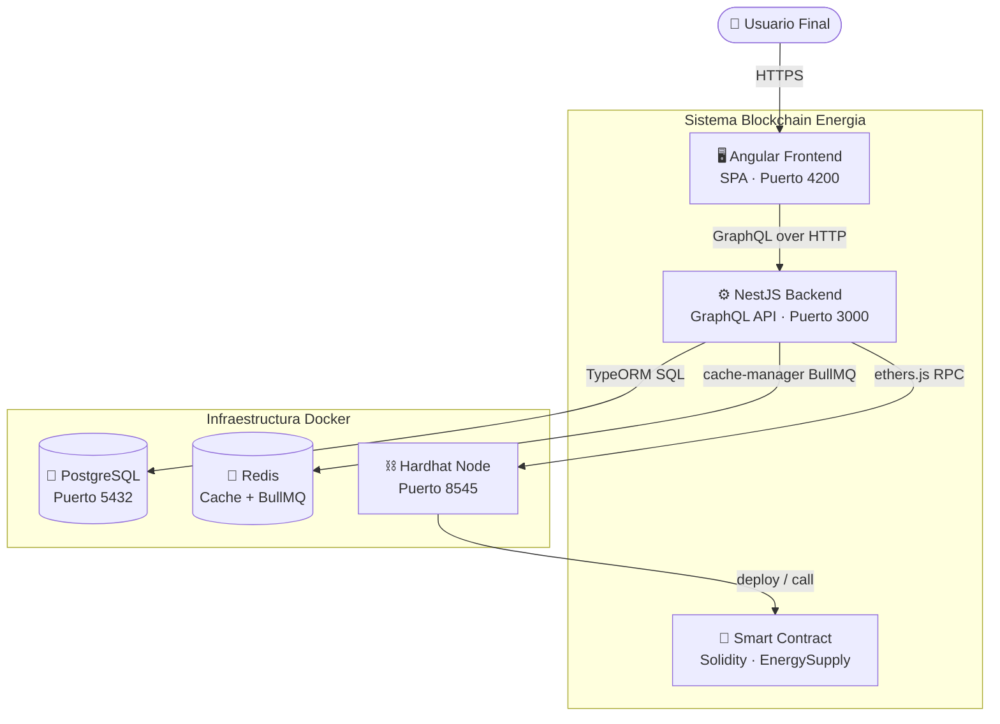
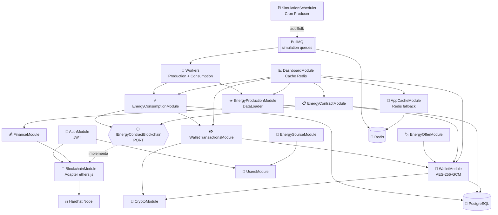

# ⚡ Blockchain Energía

> Plataforma P2P de comercio de energía renovable construida sobre Ethereum. Permite a prosumidores vender el excedente de su producción energética directamente a consumidores mediante contratos inteligentes, sin intermediarios.

<div align="center">


</div>

---

## Tabla de contenidos

- [Arquitectura](#arquitectura)
- [Tecnologías](#tecnologías)
- [Requisitos](#requisitos)
- [Instalación y puesta en marcha](#instalación-y-puesta-en-marcha)
- [Variables de entorno](#variables-de-entorno)
- [Scripts disponibles](#scripts-disponibles)
- [Patrones de diseño implementados](#patrones-de-diseño-implementados)
- [Estructura del proyecto](#estructura-del-proyecto)

---

## Arquitectura

El sistema está compuesto por tres capas principales que se comunican entre sí:

```
[Angular Frontend] ──GraphQL──▶ [NestJS Backend] ──ethers.js──▶ [Hardhat / Ethereum]
                                       │
                              ┌────────┴────────┐
                         [PostgreSQL]        [Redis]
```

## Diagramas de Arquitectura

### Vista General del Sistema


El backend implementa **Arquitectura Hexagonal (Ports & Adapters)**, separando la lógica de negocio de los detalles de infraestructura. La comunicación con la blockchain se abstrae detrás de la interfaz `IEnergyContractBlockchain`, lo que permite reemplazar el proveedor blockchain sin modificar los servicios de dominio.

### Diagrama de módulos

```
DashboardModule ──▶ EnergyContractModule ──▶ ⬡ PORT ──▶ BlockchainModule
                 ──▶ EnergyConsumptionModule        ──▶ Hardhat Node
                 ──▶ WalletModule ──▶ CryptoModule
                 ──▶ AppCacheModule ──▶ Redis

SimulationScheduler ──addBulk──▶ BullMQ ──▶ ProductionWorker
                                        ──▶ ConsumptionWorker
```
### Arquitectura Hexagonal del Backend


### Flujo: Contratar Energía P2P

```mermaid
sequenceDiagram
    actor Comprador
    participant GQL as GraphQL API
    participant SVC as EnergyContractService
    participant DB as PostgreSQL
    participant PORT as IEnergyContractBlockchain
    participant BC as Hardhat Node
    participant SC as Smart Contract
    Comprador->>GQL: mutation contractOffer(offerId)
    GQL->>SVC: contractOffer(userId, offerId)
    rect rgb(13,25,45)
        Note over SVC,DB: Transaccion DB ACID
        SVC->>DB: findOne EnergyOffer LOCK pessimistic_write
        DB-->>SVC: offer OPEN
        SVC->>DB: findOne buyerWallet + sellerWallet
        SVC->>DB: save EnergyContract PENDING_BLOCKCHAIN
        DB-->>SVC: contract con wallets
    end
    rect rgb(25,13,45)
        Note over SVC,SC: Registro Blockchain
        SVC->>PORT: deployEnergyContract(buyer, seller, price, dates)
        PORT->>BC: ethers.js RPC
        BC->>SC: deploy EnergySupply
        SC-->>BC: contractAddress
        BC-->>PORT: txHash
        PORT-->>SVC: contractAddress
        SVC->>PORT: activateContract(contractAddress)
        PORT->>BC: activate()
        BC-->>SVC: confirmed
    end
    SVC->>DB: update contract ACTIVE + contractAddress
    GQL-->>Comprador: id contractAddress status ACTIVE
```

---

## Tecnologías

| Capa | Tecnología | Versión |
|---|---|---|
| Frontend | Angular | 21 |
| Backend | NestJS | 10 |
| API | GraphQL (Apollo) | 4 |
| ORM | TypeORM | 0.3 |
| Smart Contracts | Solidity + Hardhat | 0.8 / 3 |
| Base de datos | PostgreSQL | 16 |
| Caché / Colas | Redis + BullMQ | 7 |
| Cifrado | AES-256-GCM (Node crypto) | — |
| Blockchain client | ethers.js | 6 |
| Contenedores | Docker Compose | v5 |
| Tests | Jest + @nestjs/testing | 30 |

---

## Requisitos

- [Node.js](https://nodejs.org/) >= 20
- [Docker Desktop](https://www.docker.com/products/docker-desktop/) con WSL2 (Windows) o Docker Engine (Linux/Mac)
- Git

---

## Instalación y puesta en marcha

### 1. Clonar el repositorio

```bash
git clone https://github.com/tu-usuario/blockchain-energia.git
cd blockchain-energia
```

### 2. Levantar la infraestructura con Docker

```bash
docker compose up -d
```

Esto levanta PostgreSQL (puerto 5432) y Redis (puerto 6379). Verifica que estén `healthy`:

```bash
docker compose ps
```

### 3. Configurar variables de entorno del backend

```bash
cp backend/.env.example backend/.env
```

Edita `backend/.env` con tus valores (ver sección [Variables de entorno](#variables-de-entorno)).

### 4. Instalar dependencias e iniciar el backend

```bash
cd backend
npm install
npm run start:dev
```

El servidor GraphQL estará disponible en `http://localhost:3000/graphql`.

### 5. Iniciar el nodo Hardhat (blockchain local)

En una terminal separada:

```bash
cd smart-contracts
npm install
npx hardhat node
```

El nodo RPC estará disponible en `http://localhost:8545`.

### 6. Instalar dependencias e iniciar el frontend

En otra terminal:

```bash
cd frontend
npm install
ng serve
```

La aplicación estará disponible en `http://localhost:4200`.

---

## Variables de entorno

Crea el archivo `backend/.env` con las siguientes variables:

```env
# Base de datos
DB_HOST=localhost
DB_PORT=5432
DB_USER=energia_user
DB_PASS=energia_pass
DB_NAME=blockchain_energia
DB_SYNC=true

# Redis
REDIS_URL=redis://localhost:6379

# JWT — mínimo 32 caracteres
JWT_SECRET=cambia_esto_por_un_secreto_seguro_minimo_32_chars

# Cifrado de wallets — exactamente 32 caracteres
# CRÍTICO: no cambiar en producción, perderías las wallets cifradas
WALLET_ENCRYPTION_KEY=cambia_esto_exactamente_32_chars!

# Blockchain
BLOCKCHAIN_RPC=http://localhost:8545
PLATFORM_PRIVATE_KEY=0xac0974bec39a17e36ba4a6b4d238ff944bacb478cbed5efcae784d7bf4f2ff80

# App
NODE_ENV=development
PORT=3000
FRONTEND_URL=http://localhost:4200
```

> ⚠️ La cuenta de `PLATFORM_PRIVATE_KEY` corresponde a la cuenta #0 de Hardhat. Nunca usar en producción.

---

## Scripts disponibles

### Backend

```bash
npm run start:dev     # Desarrollo con hot-reload
npm run start:prod    # Producción (requiere build previo)
npm run build         # Compilar TypeScript
npm test              # Ejecutar tests unitarios
npm run test:cov      # Tests con reporte de cobertura
npm run test:watch    # Tests en modo watch
```

### Docker

```bash
docker compose up -d        # Levantar infraestructura (PostgreSQL + Redis)
docker compose down         # Apagar (datos conservados en volumes)
docker compose down -v      # Apagar y eliminar datos
docker compose ps           # Estado de los servicios
docker compose logs redis   # Logs de un servicio específico
```

### Smart Contracts

```bash
npx hardhat node            # Levantar nodo local
npx hardhat compile         # Compilar contratos
npx hardhat test            # Tests de contratos
npx hardhat run scripts/deploy.ts --network localhost  # Desplegar
```

---

## Patrones de diseño implementados

### Arquitectura Hexagonal (Ports & Adapters)

La lógica de negocio en `EnergyContractService` y `EnergyConsumptionService` depende de la interfaz `IEnergyContractBlockchain` (puerto), no de `BlockchainService` directamente. Esto permite mockear la blockchain en los tests sin necesitar un nodo real.

```
EnergyContractService ──▶ IEnergyContractBlockchain  ◀── BlockchainService
        (dominio)               (puerto)                    (adaptador)
```

### Cache-Aside con Redis

El `DashboardService` implementa el patrón cache-aside en sus 6 métodos de agregación, con TTLs diferenciados según la volatilidad del dato (5 min para datos en tiempo real, 15 min para datos históricos). Incluye fallback automático a memoria si Redis no está disponible.

### DataLoader (prevención de N+1)

Los resolvers GraphQL de `EnergyContract` y `EnergyProduction` usan DataLoader para batching de queries. En lugar de ejecutar 1 query por contrato al resolver `consumptions`, se ejecuta una única query con `WHERE contractId IN (...)`.

### Producer/Consumer con BullMQ

Las simulaciones de producción y consumo energético se procesan fuera del hilo principal. El `SimulationScheduler` solo encola jobs con `addBulk()` y retorna inmediatamente. Los `ProductionWorker` y `ConsumptionWorker` procesan los jobs en paralelo.

### Cifrado AES-256-GCM

Las claves privadas de las wallets Ethereum se cifran con AES-256-GCM antes de persistir en base de datos. El formato almacenado es `iv:authTag:encryptedData`, donde el `authTag` garantiza la integridad del ciphertext (detecta manipulaciones).

---

## Estructura del proyecto

```
blockchain-energia/
├── backend/                    # API NestJS
│   └── src/
│       ├── application/        # Capa de aplicación (Dashboard)
│       ├── auth/               # Autenticación JWT
│       ├── energy/             # Dominio energía
│       │   ├── energy-contracts/
│       │   ├── energy-consumption/
│       │   ├── energy-offer/
│       │   ├── energy-production/
│       │   └── energy-source/
│       ├── finance/            # Dominio finanzas (Wallet)
│       ├── infrastructure/     # Adaptadores (Blockchain, Redis, Crypto)
│       ├── simulation/         # BullMQ workers y scheduler
│       └── users/
├── frontend/                   # SPA Angular
├── smart-contracts/            # Contratos Solidity + Hardhat
└── docker-compose.yml          # PostgreSQL + Redis
```

---

## Tests

```bash
cd backend && npm test
```

```
Test Suites: 3 passed
Tests:       36 passed
Snapshots:   0 total

CryptoService     → 100% cobertura (15 casos)
WalletService     → 100% cobertura (8 casos)
EnergyContractService → cancelContract + findById (12 casos)
```
