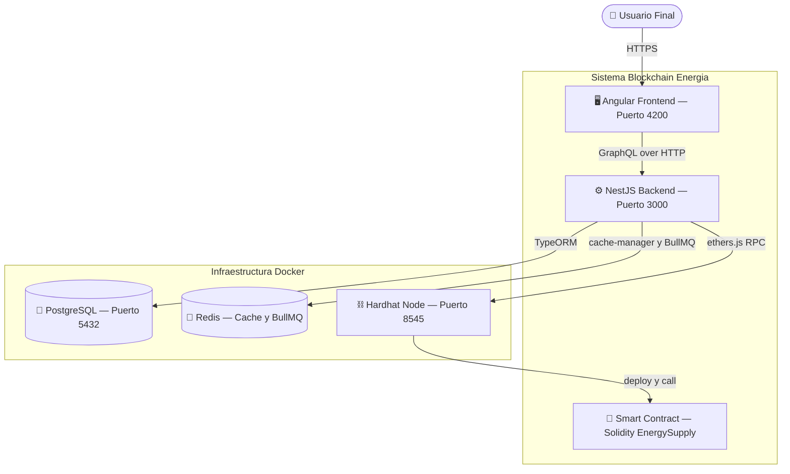
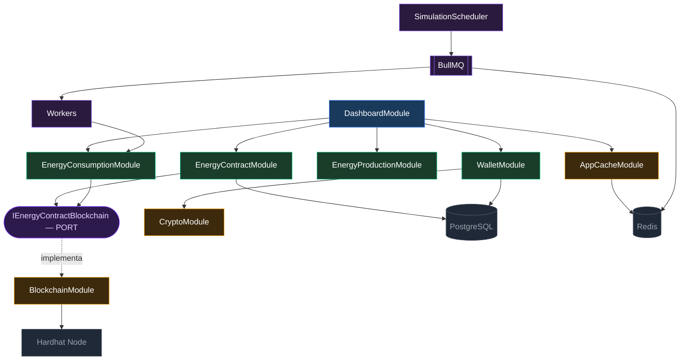

# ⚡ Blockchain Energía

> Plataforma P2P de comercio de energía renovable construida sobre Ethereum. Permite a prosumidores vender el excedente de su producción energética directamente a consumidores mediante contratos inteligentes, sin intermediarios.

<div align="center">


</div>

---

## Tabla de contenidos

- [Arquitectura](#arquitectura)
- [Tecnologías](#tecnologías)
- [Requisitos](#requisitos)
- [Instalación y puesta en marcha](#instalación-y-puesta-en-marcha)
- [Variables de entorno](#variables-de-entorno)
- [Scripts disponibles](#scripts-disponibles)
- [Patrones de diseño implementados](#patrones-de-diseño-implementados)
- [Estructura del proyecto](#estructura-del-proyecto)
- [Tests](#tests)

---

## Arquitectura

### Vista general del sistema



### Arquitectura hexagonal del backend

El backend implementa el patrón **Ports and Adapters**. La lógica de negocio depende de interfaces (puertos), no de implementaciones concretas. La blockchain puede reemplazarse sin modificar los servicios de dominio.



### Flujo: contratar energía P2P

```mermaid
sequenceDiagram
    actor Comprador
    participant BE as NestJS Backend
    participant DB as PostgreSQL
    participant PORT as IEnergyContractBlockchain
    participant BC as Hardhat Node

    Comprador->>BE: mutation contractOffer(offerId)

    rect rgb(20, 40, 80)
        Note over BE,DB: Transaccion DB ACID
        BE->>DB: findOne EnergyOffer con LOCK
        BE->>DB: findOne buyerWallet y sellerWallet
        BE->>DB: save EnergyContract PENDING_BLOCKCHAIN
    end

    rect rgb(40, 20, 80)
        Note over BE,BC: Registro en Blockchain
        BE->>PORT: deployEnergyContract(buyer, seller, price, dates)
        PORT->>BC: ethers.js RPC deploy EnergySupply
        BC-->>PORT: contractAddress
        BE->>PORT: activateContract(contractAddress)
        BC-->>BE: confirmed
    end

    BE->>DB: update contract ACTIVE
    BE-->>Comprador: contractAddress y status ACTIVE
```



---

## Tecnologías

| Capa | Tecnología | Versión |
|---|---|---|
| Frontend | Angular | 21 |
| Backend | NestJS | 10 |
| API | GraphQL — Apollo | 4 |
| ORM | TypeORM | 0.3 |
| Smart Contracts | Solidity y Hardhat | 0.8 / 3 |
| Base de datos | PostgreSQL | 16 |
| Caché y Colas | Redis y BullMQ | 7 |
| Cifrado | AES-256-GCM — Node crypto | — |
| Blockchain client | ethers.js | 6 |
| Contenedores | Docker Compose | v5 |
| Tests | Jest y @nestjs/testing | 30 |

---

## Requisitos

- [Node.js](https://nodejs.org/) >= 20
- [Docker Desktop](https://www.docker.com/products/docker-desktop/) con WSL2 (Windows) o Docker Engine (Linux/Mac)
- Git

---

## Instalación y puesta en marcha

### 1. Clonar el repositorio

```bash
git clone https://github.com/tu-usuario/blockchain-energia.git
cd blockchain-energia
```

### 2. Levantar la infraestructura con Docker

```bash
docker compose up -d
```

Esto levanta PostgreSQL (puerto 5432) y Redis (puerto 6379). Verifica que estén `healthy`:

```bash
docker compose ps
```

### 3. Configurar variables de entorno del backend

```bash
cp backend/.env.example backend/.env
```

Edita `backend/.env` con tus valores (ver sección [Variables de entorno](#variables-de-entorno)).

### 4. Instalar dependencias e iniciar el backend

```bash
cd backend
npm install
npm run start:dev
```

El servidor GraphQL estará disponible en `http://localhost:3000/graphql`.

### 5. Iniciar el nodo Hardhat (blockchain local)

En una terminal separada:

```bash
cd smart-contracts
npm install
npx hardhat node
```

El nodo RPC estará disponible en `http://localhost:8545`.

### 6. Instalar dependencias e iniciar el frontend

En otra terminal:

```bash
cd frontend
npm install
ng serve
```

La aplicación estará disponible en `http://localhost:4200`.

---

## Variables de entorno

Crea el archivo `backend/.env` a partir de `backend/.env.example`:

```env
# Base de datos
DB_HOST=localhost
DB_PORT=5432
DB_USER=energia_user
DB_PASS=energia_pass
DB_NAME=blockchain_energia
DB_SYNC=true

# Redis
REDIS_URL=redis://localhost:6379

# JWT — minimo 32 caracteres
JWT_SECRET=cambia_esto_por_un_secreto_seguro_minimo_32_chars

# Cifrado de wallets — exactamente 32 caracteres
WALLET_ENCRYPTION_KEY=cambia_esto_exactamente_32_chars!

# Blockchain
BLOCKCHAIN_RPC=http://localhost:8545
PLATFORM_PRIVATE_KEY=0xac0974bec39a17e36ba4a6b4d238ff944bacb478cbed5efcae784d7bf4f2ff80

# App
NODE_ENV=development
PORT=3000
FRONTEND_URL=http://localhost:4200
```

> ⚠️ `PLATFORM_PRIVATE_KEY` corresponde a la cuenta #0 de Hardhat. Nunca usar en producción.

---

## Scripts disponibles

### Backend

```bash
npm run start:dev     # Desarrollo con hot-reload
npm run start:prod    # Produccion — requiere build previo
npm run build         # Compilar TypeScript
npm test              # Tests unitarios
npm run test:cov      # Tests con reporte de cobertura
```

### Docker

```bash
docker compose up -d        # Levantar PostgreSQL y Redis
docker compose down         # Apagar — datos conservados en volumes
docker compose down -v      # Apagar y eliminar todos los datos
docker compose ps           # Estado de los servicios
```

### Smart Contracts

```bash
npx hardhat node                                              # Nodo local
npx hardhat compile                                           # Compilar contratos
npx hardhat test                                              # Tests de contratos
npx hardhat run scripts/deploy.ts --network localhost         # Desplegar
```

---

## Patrones de diseño implementados

### Arquitectura hexagonal — Ports and Adapters

`EnergyContractService` y `EnergyConsumptionService` dependen de la interfaz `IEnergyContractBlockchain` (puerto), no de `BlockchainService` directamente. Esto permite mockear la blockchain en tests sin nodo real y reemplazar el proveedor blockchain sin tocar la lógica de negocio.

### Cache-Aside con Redis

`DashboardService` aplica cache-aside en 6 métodos de agregación con TTLs según volatilidad del dato: 5 minutos para KPIs en tiempo real, 15 minutos para históricos mensuales. Fallback automático a memoria si Redis no está disponible.

### DataLoader — prevención de N+1

Los resolvers GraphQL de contratos y producción usan DataLoader para batching. N contratos con consumptions pasa de N queries individuales a una sola query `WHERE contractId IN (...)`.

### Producer/Consumer con BullMQ

`SimulationScheduler` solo encola jobs con `addBulk()` y retorna inmediatamente. `ProductionWorker` y `ConsumptionWorker` procesan los jobs en paralelo fuera del hilo principal, sin bloquear la API.

### Cifrado AES-256-GCM

Las claves privadas de wallets Ethereum se cifran antes de persistir en base de datos. Formato almacenado: `iv:authTag:encryptedData`. El `authTag` de GCM detecta cualquier manipulación del ciphertext.

---

## Estructura del proyecto

```
blockchain-energia/
├── backend/
│   └── src/
│       ├── application/        # Dashboard y KPIs
│       ├── auth/               # JWT y guards
│       ├── energy/             # Dominio — contratos, consumo, ofertas, produccion, fuentes
│       ├── finance/            # Dominio — wallets y transacciones
│       ├── infrastructure/     # Adaptadores — blockchain, Redis, crypto
│       ├── simulation/         # BullMQ scheduler y workers
│       └── users/
├── frontend/                   # SPA Angular
├── smart-contracts/            # Contratos Solidity y scripts Hardhat
└── docker-compose.yml
```

---

## Tests

```bash
cd backend
npm test              # Ejecutar
npm run test:cov      # Con cobertura
```

```
Test Suites : 3 passed
Tests       : 36 passed

CryptoService          100% — constructor, encrypt, decrypt, seguridad
WalletService          100% — crear wallet, cifrado, wallet del sistema
EnergyContractService   48% — cancelContract, findById, acceso blockchain
```
